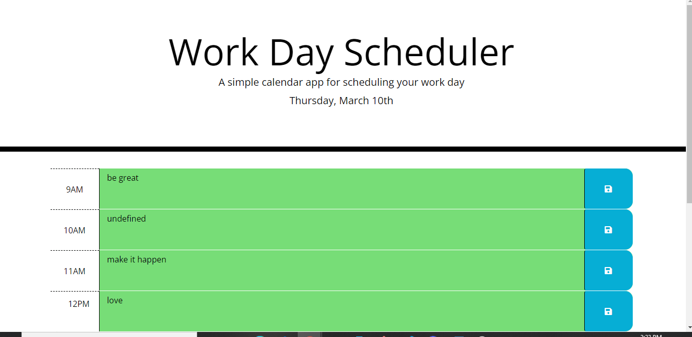

# work-day-scheduler
[githun=b](https://github.com/olacase/work-day-scheduler)

## Table of contents

## Introduction
code to create and organize a daily work schedule from 9am to 5pm.

## Installation
![Directions for use] Click on the url  https://olacase.github.io/work-day-scheduler/

## Usage
organize daily to do list

## Tools
HTML
CSS
JavaScript
Bootstrap
Moment.JS

## Contributions
none at the moment

## Tests
none
